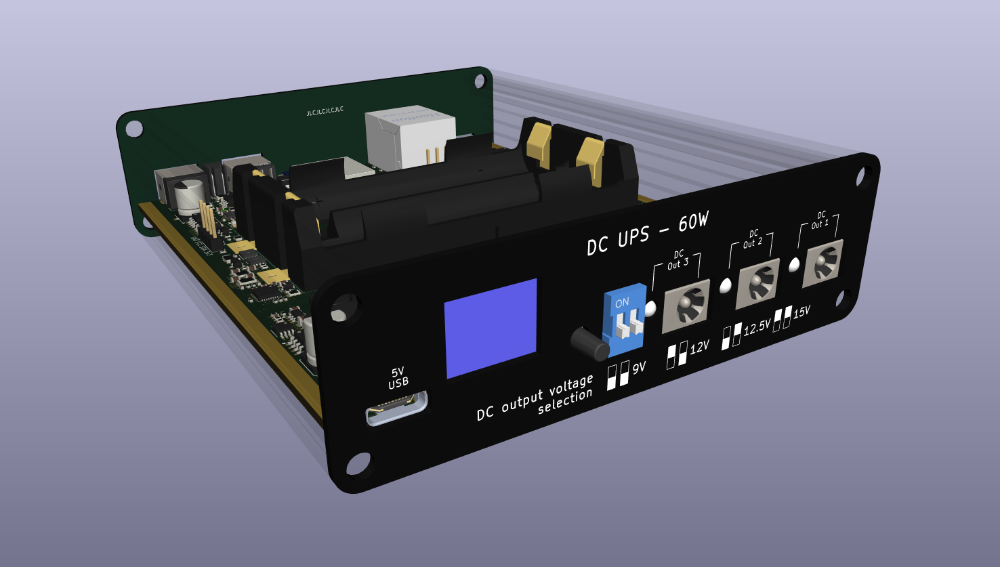
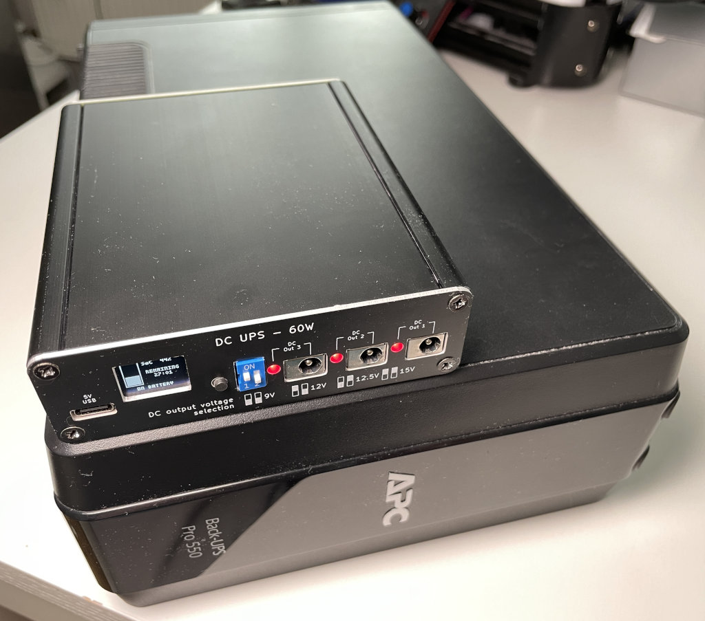

DC uninterruptible power supply
===============================

This repository contains the design files for a DC uninterruptible power
supply well suited to run network appliances like small switches, home
routes and WLAN access points.

# Features

 - 3 DC outputs
 - Selectable output voltage (9V/12V/12.5V/15V)
 - USB-C power output (5V only, 3A)
 - Builtin battery (2x Li-Ion 18650)
 - Builtin Prometheus-exporter with comprehensive metrics
 - Open Source firmware (ESP32-based, esp-idf framework)
 - Easy software updates via back USB port

# Construction

The mechanical construction of the DC UPS is based on 4 assemblies:
 - Hammond Manufacturing 1455L1601 aluminum case
 - Main PCB
 - Aluminum core PCB front panel
 - Aluminum core PCB back panel

The three PCBs have been optimized for manufacturing through JLCPCB.  
The main PCB is also designed to be suitable for assembly through JLCPCB.  

The relevant fabrication files are located in `fab`.

## Main PCB assembly

When using the JLCPCB assembly service only a very limited number of
components needs to be assembled by hand:
 - Battery holder B1
 - OLED display U17

# Firmware

The DC UPS is running Open Source firmware. Firmware source can be found on
GitHub here: [https://github.com/TobleMiner/dc-ups-firmware](https://github.com/TobleMiner/dc-ups-firmware)

# Why?

For a long time I was running the core of my home network (a cable modem,
router and switch) off a normal line-interactive AC UPS.  
This was never ideal for a number of reasons. First of all the UPS was
using sealed lead acid batterys. The UPS did not seem to treat those too
kindly and ended up degrading them beyond the point of useful capacity
within 2 - 5 years, depending on quality of the battery.  
Also I noticed that the UPS was always getting somewhat warm, suggesting
high idle power consumption. In this particular setup the core network
components only use about 12W. The AC UPS alone already used 10W while
idle. Quite the waste of power.  
Another worrying factor was overall system reliability. With the AC UPS
there were three seperate wall warts in use, each powering a single
device. Powering all network compoenents with DC directly this is down
to just one wall wart at the power input of the UPS itself.  
Additionally I was never quite happy with the monitoring options offered
by the AC UPS. While it was equipped with a USB port for monitoring the
available metrics were minimal. The DC UPS offers an Ethernet port and
hosts a Prometheus exporter offering all kinds of metrics relating to
power input and output, temperatures, battery health and battery
management internals.  
Finally the DC UPS is a lot smaller than available AC UPS options. The
following picture shows a comparison between the AC UPS I have been using
before and the DC UPS:  

